# CTFd-discord
Discord bot to display events and information about a CTFd instance (https://ctfd.io/) 

## Add to your discord server

You can use [this link](https://discordapp.com/api/oauth2/authorize?client_id=611342285220610118&permissions=0&scope=bot)

> During the whole CTF event, the eye of Sauron is watching you !

## Features 

### on start

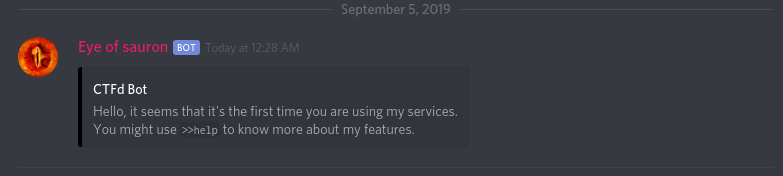

### events

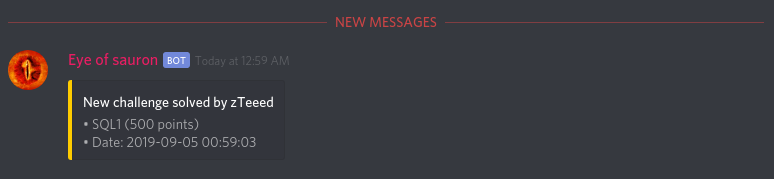
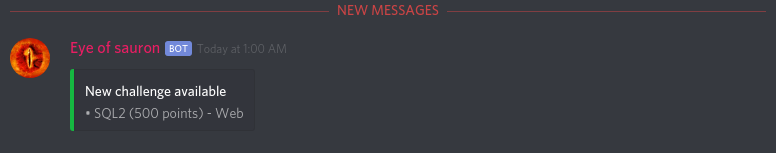

### commands

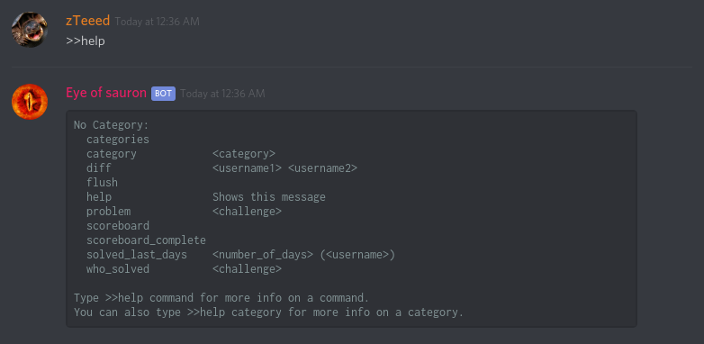

### categories

Show list of categories

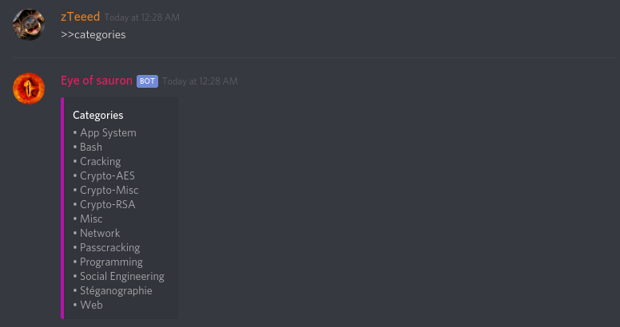

### category

Show list of challenges from a category.

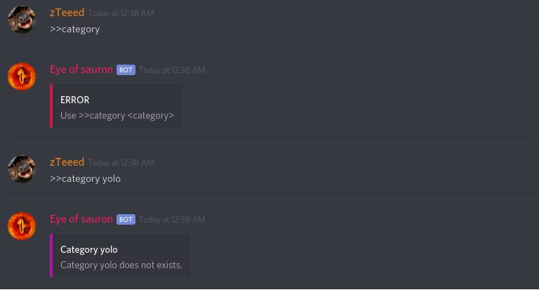
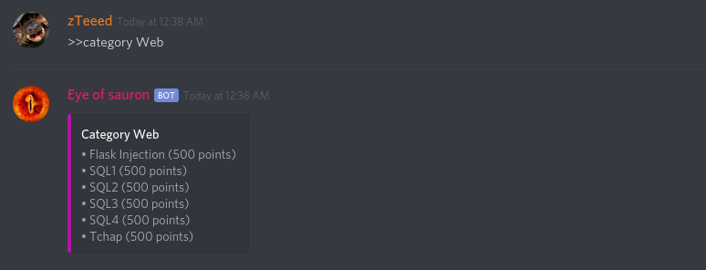

### scoreboard

scoreboard: Show ranking of CTFd (20 first players)
scoreboard_complete: Show ranking of CTFd.

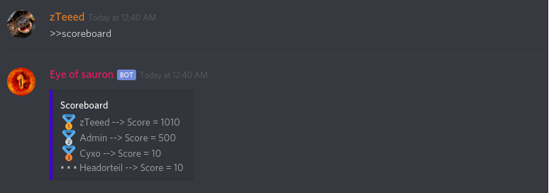

### problem

Mention discord users if their discord id is in challenge description
        
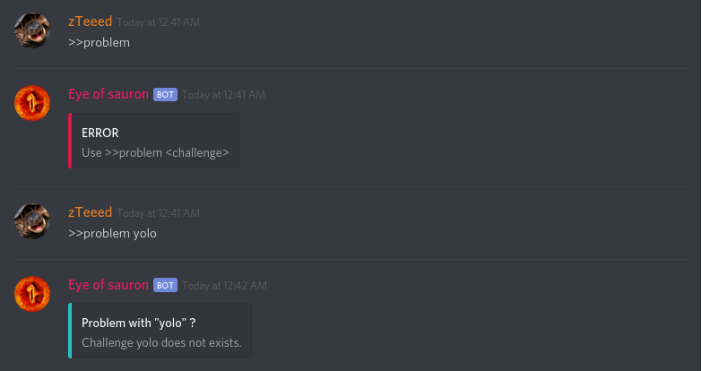
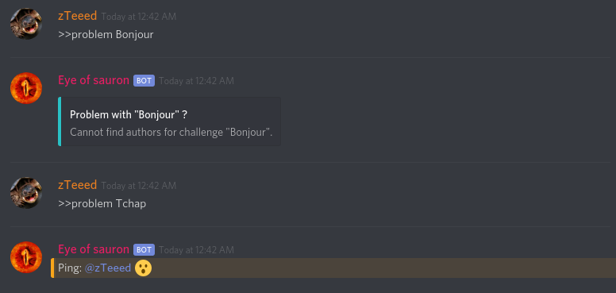

### diff

Return difference of solved challenges between two users.

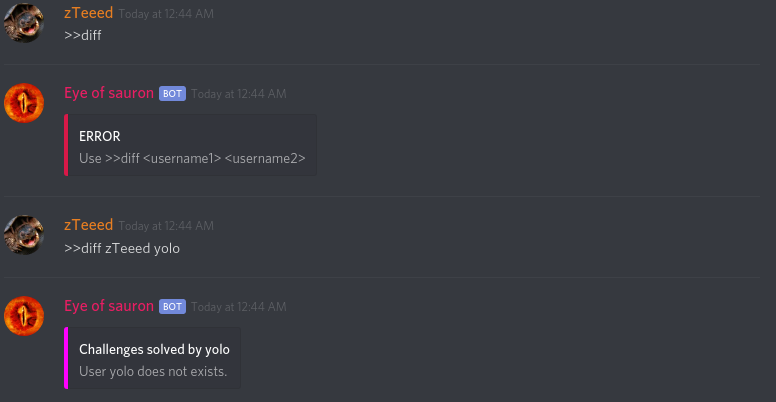
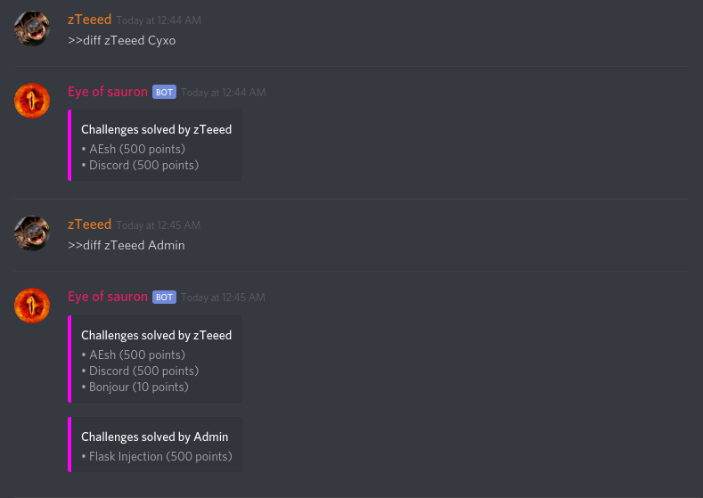

### solved_last_days

Return who solved a specific challenge.

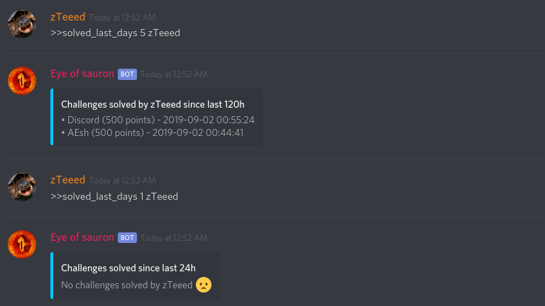

### who_solved

Return challenges solved grouped by users for last day.

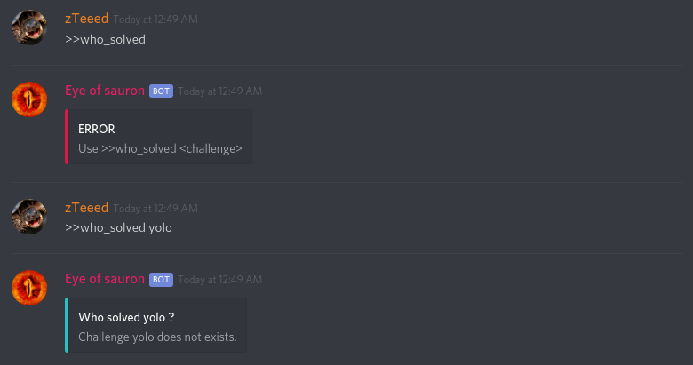
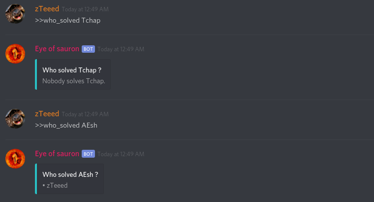

### flush

Flush all data from bot channel excepted events

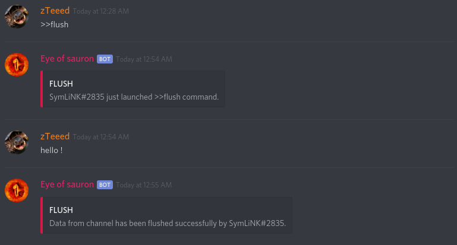
